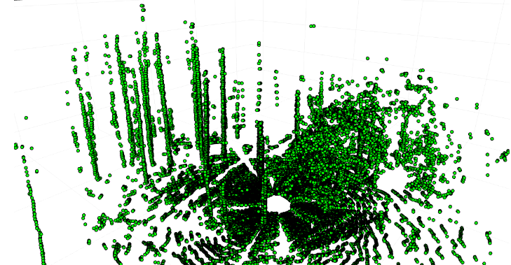
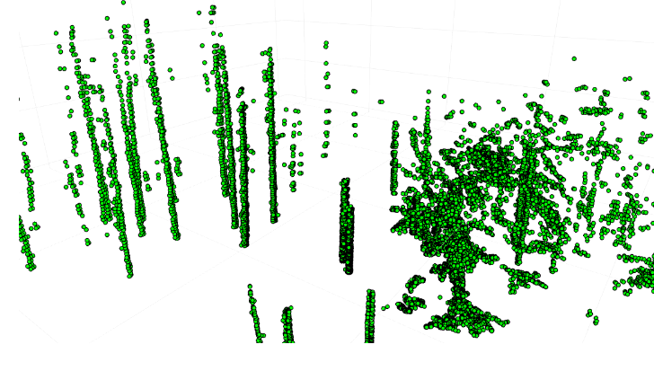
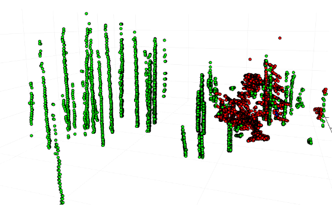

# Ground and dron removal with bare trunk classification
[](https://opensource.org/licenses/MIT)

Projekt_zmekster package provides processing Point Cloud data in .xyz format. Removal of ground, points of the drone that collected the data and subsequent classification of bare trunks. 

The data used in the examples comes from forest dataset: https://github.com/ctu-mrs/slam_datasets/tree/master/forest


# Instalation

The package is not available from official repositories and can be installed with the following command.
```
(@v1.8) pkg> add https://github.com/B0B36JUL-FinalProjects-2022/Projekt_zmeskter
```

# Usage

The project focuses on two main parts - removal of ground and drone and classification of bare trunks. All functions are implemented in files in src folder. Example usage is shown in example.jl.
For example.jl to work properly you need to activate the examples environment: 
```
activate ./examples.
```


## Removal of ground and drone

First we remove the drone points -> i.e. points at a small distance from the point (0 , 0 , 0), where distance is the drone diameter. 
Then the remaining points are sorted into a grid, where each pillar has a square base of the specified edge length. Then, the lowest point in each pillar (the first ground point) is found and points within a small distance from this point are labled as ground points.



## Classification of bare trunks

First, the data is sorted into clusters using the DBSCAN method. Then the data is projected into 2D space by neglecting the 'z' coordinate. A circle is fit to the data within each cluster using the RANSAC method and if more than k% (default k=75%) of the points lie within a specified distance from the given circle, the cluster is marked as a bare trunk.



